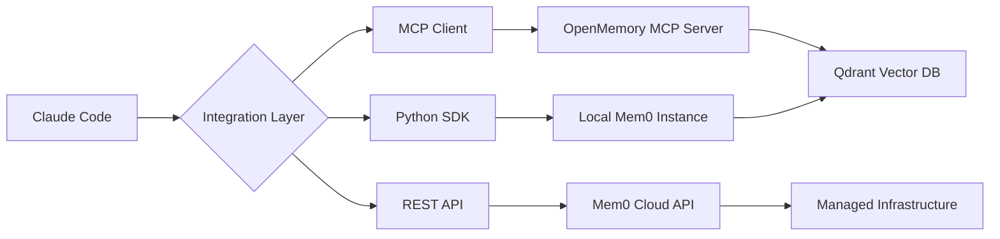

# Mem0 Integration Study for Claude Code Enhancement

## Executive Summary

This document provides a comprehensive analysis of the Mem0 project and proposes integration strategies to enhance Claude Code with external memory capabilities using **Ollama for local LLM and embedding generation**. Mem0 is a sophisticated memory layer for AI systems that provides persistent, searchable, and contextual memory storage - now configured for complete local operation without cloud dependencies.

## Project Overview

### What is Mem0?

Mem0 ("mem-zero") is an intelligent memory layer for AI assistants and agents that:
- Provides long-term memory persistence across sessions
- Offers 26% better accuracy than OpenAI Memory on benchmarks
- Delivers 91% faster responses with 90% fewer tokens than full-context approaches
- Supports multi-level memory (User, Session, Agent states)

### Key Architecture Components

```
mem0/
├── mem0/                     # Core Python library
│   ├── memory/              # Memory management core
│   ├── client/              # API client implementation
│   ├── llms/                # LLM integrations
│   ├── embeddings/          # Embedding models
│   ├── vector_stores/       # Vector database integrations
│   └── graphs/              # Graph memory support
├── openmemory/              # Self-hosted OpenMemory platform
│   ├── api/                 # FastAPI backend with MCP server
│   └── ui/                  # Next.js frontend
├── vercel-ai-sdk/           # Vercel AI SDK integration
└── mem0-ts/                 # TypeScript/JavaScript SDK
```

## Integration Points for Claude Code

### 1. MCP Server Integration (RECOMMENDED - Simplest)

**Location**: `openmemory/api/app/mcp_server.py`

The project already includes a Model Context Protocol (MCP) server implementation that:
- Provides memory operations via MCP protocol
- Handles user context and client identification
- Supports add, search, list, and delete operations
- Uses SSE (Server-Sent Events) for communication

**Key Features**:
- FastMCP-based implementation
- Context-aware memory operations
- Permission-based access control
- Lazy initialization for resilience

### 2. Direct Python SDK Integration

**Location**: `mem0/memory/main.py` and `mem0/client/main.py`

Two integration modes:
1. **Local Memory**: Direct memory instance without API
2. **Client Mode**: API-based integration with hosted service

**Core Operations**:
```python
from mem0 import Memory

# Initialize
memory = Memory()

# Add memories from conversation
memory.add(messages, user_id="user123")

# Search relevant memories
results = memory.search(query="user preferences", user_id="user123")

# Get all memories
all_memories = memory.get_all(user_id="user123")
```

### 3. Docker Containerization

**Location**: `openmemory/docker-compose.yml`

Existing Docker setup includes:
- Qdrant vector database (port 6333)
- OpenMemory MCP API (port 8765)
- OpenMemory UI (port 3000)

## Proposed Integration Approaches

### Option 1: MCP Server Integration (RECOMMENDED)

**Advantages**:
- Already implemented and tested
- Standard protocol for AI model interactions
- Minimal dependencies for Claude Code
- Clean separation of concerns

**Implementation Steps**:
1. Deploy OpenMemory MCP server via Docker
2. Configure Claude Code to connect to MCP endpoint
3. Use MCP client in Claude Code to interact with memory

**Required Changes**:
- Add MCP client support to Claude Code
- Configure connection parameters
- Map Claude Code sessions to Mem0 user IDs

### Option 2: Lightweight Python Integration with Ollama

**Advantages**:
- Direct integration without network overhead
- Full control over memory operations
- **100% local operation with Ollama**
- No API keys or cloud services required

**Implementation Steps**:
1. Install minimal dependencies: `pip install mem0ai ollama`
2. Configure Ollama for LLM and embeddings
3. Initialize memory in Claude Code startup
4. Hook into conversation flow for memory operations

**Minimal Dependencies (Ollama-based)**:
```python
# Core requirements only - NO OpenAI needed!
mem0ai>=0.1.0
ollama>=0.1.0  # Local LLM and embeddings
qdrant-client>=1.9.1
pydantic>=2.7.3
sqlalchemy>=2.0.31
```

**Ollama Configuration**:
```python
config = {
    "llm": {
        "provider": "ollama",
        "config": {
            "model": "llama3.1:8b",
            "ollama_base_url": "http://localhost:11434"
        }
    },
    "embedder": {
        "provider": "ollama", 
        "config": {
            "model": "nomic-embed-text",
            "ollama_base_url": "http://localhost:11434"
        }
    }
}
```

### Option 3: REST API Integration

**Advantages**:
- Language agnostic
- Can use existing Mem0 cloud service
- No local dependencies

**Implementation Steps**:
1. Obtain Mem0 API key
2. Implement HTTP client for memory operations
3. Handle authentication and session management

## Memory Integration Architecture

### Proposed Flow for Claude Code



### Memory Lifecycle in Claude Code

1. **Session Start**:
   - Generate/retrieve user ID
   - Initialize memory client
   - Load relevant memories

2. **During Conversation**:
   - Search memories for context
   - Add new facts/preferences
   - Update existing memories

3. **Session End**:
   - Persist session memories
   - Clean up resources

## Implementation Recommendations

### Phase 1: MCP Integration (Week 1)

1. **Setup Docker Environment**:
```bash
cd openmemory
docker-compose up -d
```

2. **Configure Claude Code**:
```python
# Add to Claude Code configuration
MCP_ENDPOINT = "http://localhost:8765/mcp"
MEMORY_USER_ID = generate_user_id()  # Based on session
```

3. **Implement Memory Hooks**:
- Before response: Search relevant memories
- After response: Extract and store new information

### Phase 2: Enhanced Features (Week 2-3)

1. **Memory Management UI**:
   - View stored memories
   - Manual memory editing
   - Memory statistics

2. **Advanced Features**:
   - Graph-based memory relationships
   - Memory decay/importance scoring
   - Cross-session memory sharing

### Phase 3: Optimization (Week 4)

1. **Performance Tuning**:
   - Implement caching layer
   - Optimize embedding generation
   - Batch memory operations

2. **Privacy & Security**:
   - Implement memory encryption
   - Add user consent management
   - Audit logging

## Technical Considerations

### Dependencies Management

**Minimal Setup** (MCP Client only):
- httpx or requests for HTTP
- SSE client library
- JSON parsing

**Full Integration** (Python SDK):
- mem0ai package
- Qdrant client
- OpenAI client (for embeddings)

### Storage Requirements

- **Vector Database**: ~100MB initial, grows with memories
- **SQLite**: Metadata storage, minimal space
- **Docker Images**: ~2GB total for all services

### Performance Impact

- **Memory Search**: ~50-100ms per query
- **Memory Add**: ~100-200ms per operation
- **Embedding Generation**: ~50ms per text chunk

## Security Considerations

1. **API Key Management**:
   - Store in environment variables
   - Rotate regularly
   - Use separate keys per environment

2. **Data Privacy**:
   - User consent for memory storage
   - GDPR compliance considerations
   - Data retention policies

3. **Access Control**:
   - User-specific memory isolation
   - Session-based access tokens
   - Rate limiting

## Additional Findings from Deep Dive

### Cookbooks - Implementation Patterns

The cookbooks folder provides production-ready patterns:

1. **Customer Support Chatbot** (`customer-support-chatbot.ipynb`):
   - Uses Anthropic Claude with mem0 memory
   - Demonstrates context retention across sessions
   - Shows how to handle customer history

2. **AutoGen Integration** (`mem0-autogen.ipynb`):
   - Multi-agent memory sharing
   - Teachability patterns for agents
   - Complex agent orchestration with shared knowledge

### Examples - Practical Implementations

Key implementations discovered:

1. **JavaScript/Node.js Integration** (`openai-inbuilt-tools/`):
   ```javascript
   const mem0Config = {
       apiKey: process.env.MEM0_API_KEY,
       user_id: "sample-user",
   };
   ```

2. **Multi-modal Support** (`multimodal-demo/`):
   - React-based interface
   - Image + text memory storage
   - Real-time memory updates

3. **Chrome Extension** (`yt-assistant-chrome/`):
   - Browser-based memory integration
   - YouTube assistant with memory

### Server Implementation - REST API

The `/server` folder provides a complete REST API:

**Docker Deployment** (`docker-compose.yaml`):
```yaml
services:
  postgres:
    image: pgvector/pgvector:pg16
    environment:
      POSTGRES_PASSWORD: postgres
      POSTGRES_USER: postgres
      POSTGRES_DB: mem0
    volumes:
      - postgres_data:/var/lib/postgresql/data
    ports:
      - "5432:5432"

  neo4j:
    image: neo4j:latest
    environment:
      NEO4J_AUTH: neo4j/password
    volumes:
      - neo4j_data:/data
    ports:
      - "7474:7474"
      - "7687:7687"

  mem0:
    build: .
    depends_on:
      - postgres
      - neo4j
    environment:
      - POSTGRES_HOST=postgres
      - NEO4J_URI=neo4j://neo4j:7687
      - OPENAI_API_KEY=${OPENAI_API_KEY}
    ports:
      - "8080:8080"
```

### MCP Server Integration - CONFIRMED APPROACH

The documentation confirms MCP server as the recommended integration for Cursor and similar IDEs:

**From `docs/integrations/mcp-server.mdx`**:
- Official MCP server available at: https://github.com/mem0ai/mem0-mcp
- Designed specifically for IDE integration
- Supports SSE (Server-Sent Events) protocol
- Configuration for Cursor IDE provided

**Key Benefits**:
- Persistent context storage across sessions
- Semantic search for code preferences
- Coding preference management

### Embedchain - Additional Context Layer

Embedchain (included in the project) provides:
- Framework for personalizing LLM responses
- Efficient data chunking and embedding
- Vector database management
- "Conventional but Configurable" design

## Updated Recommendation for Ollama-Based Deployment

Based on the comprehensive analysis and the requirement to use Ollama, the optimal integration path is:

### PRIMARY: Local Ollama Integration

1. **Install Ollama**:
   ```bash
   curl -fsSL https://ollama.com/install.sh | sh
   ollama serve
   ```

2. **Pull Required Models**:
   ```bash
   ollama pull llama3.1:8b        # For LLM
   ollama pull nomic-embed-text   # For embeddings
   ```

3. **Configure Mem0 for Ollama**:
   ```python
   config = {
       "llm": {"provider": "ollama", "config": {"model": "llama3.1:8b"}},
       "embedder": {"provider": "ollama", "config": {"model": "nomic-embed-text"}}
   }
   ```

### FALLBACK: OpenMemory MCP Implementation

If official mem0-mcp is not suitable, use the OpenMemory MCP server:
- Already included in `/openmemory/api/app/mcp_server.py`
- Provides same MCP protocol
- Includes additional features (ACL, audit logging)

### Simple Docker Deployment

```bash
# Using OpenMemory (included in this repo)
cd openmemory
docker-compose up -d

# Verify services
curl http://localhost:8765/health  # API
curl http://localhost:6333/health  # Qdrant
```

## Conclusion

The MCP Server integration (Option 1) provides the best balance of simplicity, maintainability, and functionality. It requires minimal changes to Claude Code while providing full memory capabilities.

**Next Steps**:
1. Deploy mem0-mcp or OpenMemory MCP server
2. Implement MCP client in Claude Code
3. Add memory search before responses
4. Store conversation insights after responses
5. Test and optimize performance

**Critical Discovery**: The project already has official MCP server support designed specifically for IDE integration, making this the clear choice for Claude Code enhancement.

## Appendix: Quick Start Commands

```bash
# Clone and setup
git clone https://github.com/mem0ai/mem0.git
cd mem0/openmemory

# Configure environment
cp api/.env.example api/.env
# Edit api/.env with your API keys

# Start services
docker-compose up -d

# Verify services
curl http://localhost:8765/health
curl http://localhost:6333/health

# Test MCP endpoint
curl http://localhost:8765/mcp/test-client/sse/test-user
```

## Resources

- [Mem0 Documentation](https://docs.mem0.ai)
- [MCP Protocol Spec](https://github.com/anthropics/mcp)
- [Qdrant Vector Database](https://qdrant.tech)
- [OpenMemory GitHub](https://github.com/mem0ai/mem0)